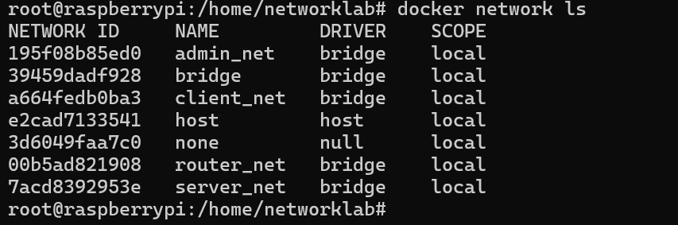

# Lab 3 – Corporate Network Infrastructure on Raspberry Pi 5
(IP addresses masked for documentation: 10.10.0.0/24, 10.20.0.0/24, 10.30.0.0/24)

This lab demonstrates how to build a simulated corporate network using Docker containers on a Raspberry Pi 5.
The environment includes a router, a company web server, an admin workstation, and three client machines.
All components run inside isolated Docker networks.

## 1.Docker Network Creation 
Three separate Docker networks were created, one for each subnet:

Admin network → 10.10.0.0/24

Client network → 10.20.0.0/24

Server network → 10.30.0.0/24

Commands used:

docker network create --subnet=10.10.0.0/24 admin_net

docker network create --subnet=10.20.0.0/24 client_net

docker network create --subnet=10.30.0.0/24 server_net

Each network provides isolation and allows static IP assignment.

## 2.Router Creation
A router container was created using Ubuntu 24.04 and attached to all three networks with fixed IP addresses:

admin_net → 10.10.0.3

client_net → 10.20.0.3

server_net → 10.30.0.3

Commands used:

docker run -d --name router --network admin_net --ip 10.10.0.3 ubuntu:24.04 tail -f /dev/null

docker network connect --ip 10.20.0.3 client_net router

docker network connect --ip 10.30.0.3 server_net router

Inside the router, IPv4 forwarding was enabled:

echo 1 > /proc/sys/net/ipv4/ip_forward

Firewall and NAT rules were applied from the host using the script router-firewall.sh.

Content of router-firewall.sh:

sysctl -w net.ipv4.ip_forward=1

iptables -F

iptables -t nat -F

iptables -t mangle -F

iptables -t nat -A POSTROUTING -o eth2 -j MASQUERADE

iptables -P INPUT DROP

iptables -P FORWARD DROP

iptables -P OUTPUT ACCEPT

iptables -A INPUT -m state --state ESTABLISHED,RELATED -j ACCEPT

iptables -A FORWARD -m state --state ESTABLISHED,RELATED -j ACCEPT

iptables -A INPUT -p icmp -j ACCEPT

iptables -A FORWARD -p icmp -j ACCEPT

iptables -A FORWARD -i eth0 -s 10.10.0.0/24 -j ACCEPT

iptables -A FORWARD -i eth1 -s 10.20.0.0/24 -d 10.30.0.2 -p tcp --dport 80 -j ACCEPT

iptables -A FORWARD -i eth1 -s 10.20.0.0/24 -d 10.30.0.2 -p tcp --dport 443 -j ACCEPT

iptables -A FORWARD -i eth1 -s 10.20.0.0/24 -j DROP tail -f /dev/null

This script ensures correct NAT, forwarding and security between the three networks.

## 3.Server Creation

docker run -d --name server1 --network server_net --ip 10.30.0.2 ubuntu:24.04 tail -f /dev/null

Inside the server container:

apt update

apt install nginx

service nginx start

Internal website available at:
http://10.30.0.2

# (For demonstration purposes, an example public corporate website is: https://www.simacyber.com)

## 4.Admin Workstation Creation

docker run -d --name admin1 --network admin_net --ip 10.10.0.2 ubuntu:24.04 tail -f /dev/null

Persistent default route via docker-compose:

command: > sh -c "ip route add default via 10.10.0.3; tail -f /dev/null"

## 5.Client Creation

docker run -d --name client1 --network client_net --ip 10.20.0.2 ubuntu:24.04 tail -f /dev/null

docker run -d --name client2 --network client_net --ip 10.20.0.4 ubuntu:24.04 tail -f /dev/null

docker run -d --name client3 --network client_net --ip 10.20.0.5 ubuntu:24.04 tail -f /dev/null

Persistent default route via docker-compose:

command: > sh -c "ip route add default via 10.20.0.3; tail -f /dev/null"

## 6.Connectivity Testing

docker exec -it admin1 curl -I http://10.30.0.2 

docker exec -it client1 curl -I http://10.30.0.2

docker exec -it client2 curl -I http://10.30.0.2 

docker exec -it client3 curl -I http://10.30.0.2 

Expected output:

HTTP/1.1 200 OK

Server: nginx/1.24.0 (Ubuntu)

## 7.Full Persistence

The environment is persistent due to:

host-side firewall script

static Docker IPs

persistent routes

Nginx auto-start

Start the full environment:

cd /home/networklab

docker compose up -d

docker ps

The environment is now fully operational and ready for further security testing.

## 8.Screenshots

docker-network-list.png

router-inspect.png

nginx-running.png

curl-admin.png

curl-client1.png

iptables-rules.png

docker-compose-up.png
